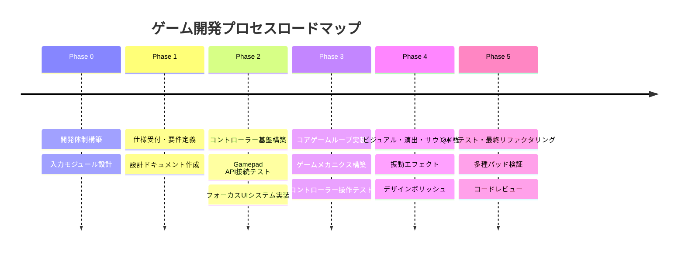

# 🛠️ Local Gamepad Game - 開発手順 & ガイドライン (DEVELOPMENT_PROCESS.md)

本ドキュメントでは、Windowsローカル環境でのコントローラー操作に特化したゲーム開発手順（ロードマップ）を定めます。

---

## 📌 開発手順ロードマップ (Development Roadmap)

---

### フェーズ別詳細手順

#### 【Phase 0】開発体制の構築と入力モジュール設計 (現在完了)
1. 開発用ディレクトリ構造のセットアップ (`local-gamepad-game/`)
2. 役割・ペルソナドキュメント (`ROLES_AND_PERSONAS.md`) の作成
3. コントローラーパッド対応標準規格（Gamepad API Standard Mapping）の採用

---

#### 【Phase 1】仕様受付 & 要件定義 (Requirements Definition)
*※ 開発体制構築後、ユーザー様からゲーム仕様の共有を受けて開始します。*
1. **ゲーム仕様のブレイクダウン**:
   - ゲームジャンル、世界観、勝利/敗北条件
   - プレイヤー操作対象（移動、攻撃、アクション等のボタン割り当て）
   - 画面構成（タイトル、ゲーム本編、ポーズ、リザルト）
2. **コントローラーマッピング定義書の策定**:
   - アナログスティック / D-Pad: 移動・カーソル操作
   - A / Southボタン: 決定 / 主アクション (ジャンプ・攻撃等)
   - B / Eastボタン: キャンセル / サブアクション
   - Start / Menuボタン: ポーズ画面の開閉

---

#### 【Phase 2】コントローラー基盤 & UIシステムの構築 (Core Input Framework)
1. **Gamepad Manager モジュールの作成 (`src/input/gamepad.js`)**:
   - フレーム毎のポーリング処理（`requestAnimationFrame` 内で `navigator.getGamepads()` 更新）
   - アナログスティックの死角（Deadzone: デフォルト0.15）補正処理
   - ボタンプレス（`justPressed`）、リリース（`justReleased`）、長押し判定のイベント化
   - コントローラー接続状態インジケーター（画面上に接続状態を視覚表示）
2. **コントローラーファースト UI フォーカスエンジン実装**:
   - キーボードのTabキーに依存しない、2次元方向入力（上下左右）によるUIフォーカス移動
   - フォーカス中の要素に対する拡大・発光・シェイク効果のCSS / JS実装

---

#### 【Phase 3】コアゲームループ & メカニクス実装 (Core Gameplay Loop)
1. **メインループ & 物理/描画モジュールの実装**:
   - デルタタイム (`deltaTime`) ベースの滑らかなフレーム制御 (60FPS以上)
2. **プレイヤーキャラクター操作の実装**:
   - コントローラー入力値（スティック角度・傾き量）に連動した加減速物理
3. **ゲームルール & イベントの実装**:
   - 当たり判定、スコア計算、状態管理（State Pattern: Title -> Playing -> Paused -> GameOver）

---

#### 【Phase 4】ビジュアル・エフェクト・サウンド・振動のポリッシュ (Polish & Experience)
1. **Antigravity リッチデザインシステムの適用**:
   - 深みのある配色、グラデーション、パーティクルエフェクト、アニメーション
2. **サウンド & 振動連動 (Audio & Haptics)**:
   - Web Audio API による低遅延効果音再生
   - `gamepad.vibrationActuator.playEffect()` を用いたアクション時のデュアルショック/振動演出

---

#### 【Phase 5】QA・テスト・コードレビュー (QA & Final Audit)
1. **コントローラー操作性・動作検証**:
   - 入力遅延のチェック、各ボタンの誤作動チェック
   - コントローラー未接続時のガイダンス表示およびキーボード操作フォールバックの動作確認
2. **開発完了チェック（dev-review-refactor スキル適用）**:
   - コードの構造化・リファクタリング
   - セキュリティ、パフォーマンス、メモリリークの最終確認

---

## 🎮 Windowsローカル環境でのコントローラー動作検証手順

1. **コントローラーの接続**:
   - USBまたはBluetoothでXboxコントローラー、DualSense、または汎用ゲームパッドをWindows PCに接続。
2. **Web Gamepad API のブラウザ認識確認**:
   - ブラウザでページを開き、ゲームパッドの任意のボタンを押してブラウザにアクティベート。
3. **入力デバッグ表示**:
   - 画面隅に入力ログ（接続中パッド名、スティックXY値、押下ボタン番号）をリアルタイム表示するデバッグモードを常備。

---

## 🚀 次のステップ
開発体制および開発手順の構築が完了しました！
ユーザー様より **ゲームの仕様（ジャンル、ルール、登場キャラクター、操作方法など）** をお聞かせいただき次第、ただちに **Phase 1 (仕様受付 & 設計)** から開発を開始いたします。
