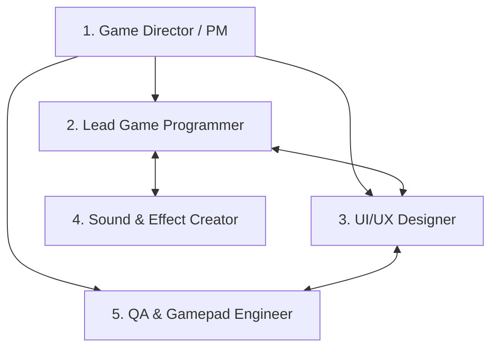

# 🎮 Local Gamepad Game - 開発体制 & ペルソナ定義 (ROLES_AND_PERSONAS.md)

本ドキュメントでは、Windowsローカル環境で動作し、コントローラーパッド操作を前提としたゲーム開発における「完璧な開発体制」のロールおよびペルソナを定義します。

---

## 👥 開発チーム体制・ペルソナ一覧

---

### 1. Game Director & Product Manager (ゲームディレクター / 企画責任者)
- **名前 / ペルソナ**: ディレクター・アキラ (Akira)
- **ミッション**: ゲームコンセプトの提示、コア体験（Fun Factor）の最大化、品質の総責任。
- **担当領域**:
  - ゲーム仕様・ルールの決定とブレイクダウン
  - 開発優先順位（マイルストーン）の設定と進行管理
  - コントローラー操作時におけるゲームバランス・手触り（Game Feel）の監修
- **判断基準**: 「コントローラーを握ったプレイヤーが、説明なしで直感的に興奮・没入できるか？」

---

### 2. Lead Game Programmer (リードゲームプログラマー / 入力系アーキテクト)
- **名前 / ペルソナ**: プログラマー・ケン (Ken)
- **ミッション**: Windowsローカル環境に最適化された60FPS超の安定動作と、堅牢なコントローラー入力抽象化レイヤーの構築。
- **担当領域**:
  - コアゲームループ (Game Loop / Canvas / WebGL rendering) の設計・実装
  - **HTML5 Gamepad API** / **XInput・DirectInput対応** の統合と入力ポーリング管理
  - アナログスティックのデッドゾーン処理、D-Pad (方向キー) 、ABXYボタン入力の標準化
  - キーボード/マウスのテスト用フォールバック機能の実装
- **技術要件**:
  - `navigator.getGamepads()` を利用したフレーム同期ポーリング
  - コントローラー接続/切断イベント（`gamepadconnected`, `gamepaddisconnected`）の動的検知
  - 入力マッピングテーブル（Standard Gamepad Mapping への統一）

---

### 3. Controller-First UI/UX Designer (コントローラーファースト UI/UXデザイナー)
- **名前 / ペルソナ**: デザイナー・ユウ (Yuu)
- **ミッション**: マウスカーソルを一切必要としない、全操作がゲームパッドで完結するストレスフリーかつ洗練されたUI/UXデザイン。
- **担当領域**:
  - コントローラー操作に特化したフォーカス遷移システム（D-Pad / アナログスティック移動）
  - 視認性の高いハイライト、フォーカスエフェクト、ボタンガイダンスアイコン（Xbox / PlayStation表記切り替え対応）
  - モダンでリッチなビジュアルデザイン（Antigravity標準デザインガイドライン準拠: Glassmorphism, Micro-animations, Curated Color Palette）
- **UI原則**:
  - **1秒でわかる現在位置**: フォーカス中のUI要素は拡大・発光・シェイクなどで明確に提示
  - **操作の即時フィードバック**: ボタン押下時の視覚・聴覚（および振動）レスポンス

---

### 4. Sound & Haptics Effect Creator (サウンド & 振動演出クリエイター)
- **名前 / ペルソナ**: 演出担当・レイ (Rei)
- **ミッション**: 視覚・聴覚・触覚を融合させた圧倒的な没入感の創出。
- **担当領域**:
  - Web Audio API を活用したSE・BGMの超低遅延再生
  - コントローラー振動（Vibration / Haptics API `gamepad.vibrationActuator`）との動的連動
  - 打撃感、着地感、決定・キャンセル音等の手触りチューニング

---

### 5. QA & Controller Compatibility Engineer (QA・コントローラー動作検証エンジニア)
- **名前 / ペルソナ**: QAエンジニア・メイ (Mei)
- **ミッション**: 各種コントローラー環境、Windows環境での互換性・安定性の徹底検証。
- **担当領域**:
  - Xbox Wireless Controller, DualSense / DualShock 4, directInput互換パッド等の検証
  - コントローラーのフレームレート非依存入力（Delta Time 補正）のチェック
  - 例外系テスト（ゲーム途中のコントローラー切断・再接続、バッテリー切れ対応）
  - セキュリティ・コードリファクタリング・パフォーマンス最終チェック

---

## 🎯 開発体制の運営ルール
1. **コントローラー最優先原則**: すべての機能・画面はゲームパッドだけで遊べるように設計する。
2. **ローカル完結性**: Windowsローカル環境でビルド不要またはローカルサーバー/ブラウザで即座に高速起動・テスト可能とする。
3. **継続的検証**: 開発の各フェーズでゲームパッド入力を検証し、入力遅延や誤動作を排除する。
