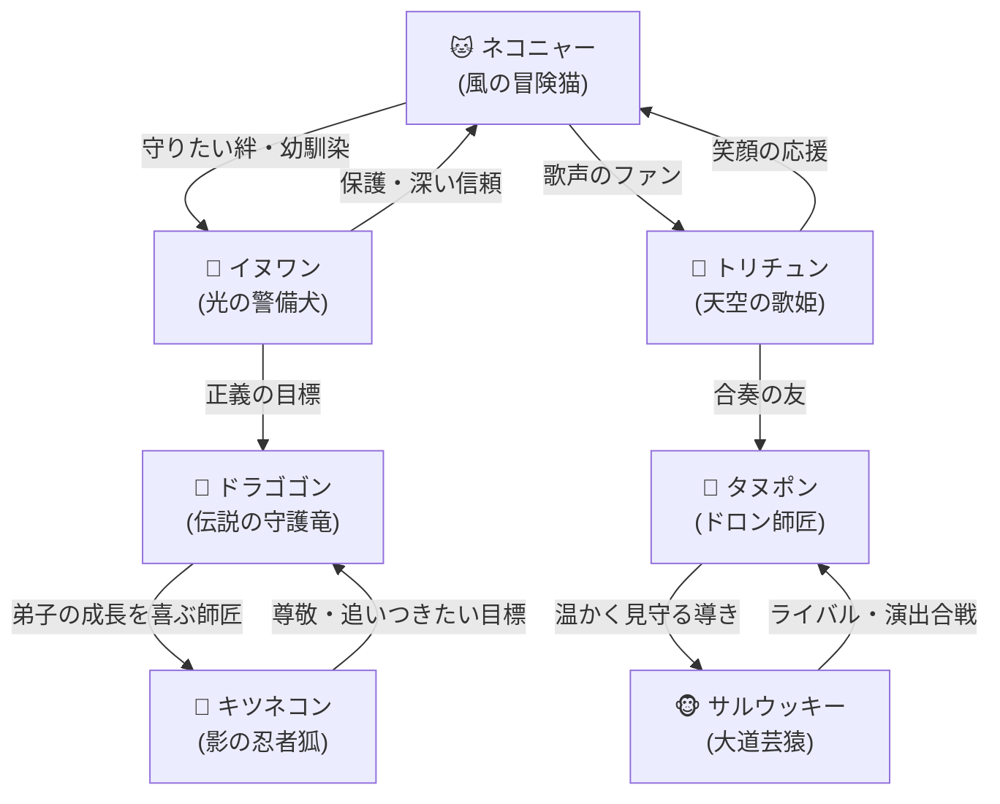

# 🐾『テトリスン』公式完全設定資料＆世界観ガイド (Master World Guide & Character Lore)

---

## 🔮 1. 世界観と物語 (World & Story Background)

### 【世界の伝承：パステリア王国と七色のオーロラ】
天空に浮かぶ魔法のパステル都市**「パステリア王国」**。
この国では、100年に一度、天空を七色のオーロラが包み込む神秘の季節が訪れる。
その時開催されるのが、王国伝統のパステル魔法パズル大会**『パステル・グランプリ』**である。

グランプリの覇者には、王国の守護竜ドラゴゴンが管理する至宝**「星詠みのレインボーピース」**が与えられる。
その秘宝は、「胸に抱く最も切実な願い」を一つだけ叶えるという——。

パズル盤面という名の魔法陣の上で、7匹の魔法動物たちの譲れない想い、友情、ライバル関係が交錯する。

---

## 👥 2. 登場キャラクター詳細プロフィール (Character Profiles)

### 1. 🐱 ネコニャー (Nekonya)
- **種族**: 風の魔法猫 (Wind Cat)
- **イメージカラー**: パステルピンク (`#FFB7C5`)
- **属性 / 得意技**: 風・気まぐれ / `奇数行ランダム消去`
- **CVイメージ / 口調**: 明るく無邪気、「〜ニャ！」
- **【秘められた動機】**:
  表向きは「伝説の極上パフェを食べたいニャ！」とお気楽に振る舞っているが、本当は幼馴染のイヌワンや王国の仲間たちがいつも笑顔でいられる「終わらない楽しい日常」を守りたいと思っている。
- **【パズルスタイル】**: **超高速連鎖型**（スピードスター）
- **【決めゼリフ】**: 
  - 「ニャんてね！気まぐれに風を切るニャ！」
  - 「一気に駆け抜けるニャ！パステルブロック、完成ニャ！」

---

### 2. 🐶 イヌワン (Inuwan)
- **種族**: 光の魔法犬 (Light Guard Dog)
- **イメージカラー**: パステルイエロー (`#FFDF80`)
- **属性 / 得意技**: 光・忠義 / `お邪魔ブロックカウンター`
- **CVイメージ / 口調**: 礼儀正しく熱血、「〜ワン！」
- **【秘められた動機】**:
  王国警備隊の見習い。危なっかしい冒険心を持つ幼馴染のネコニャーを一生守るため、警察犬としての誇りと強さを証明しようと大会に挑む。
- **【パズルスタイル】**: **カウンター防衛型**（鉄壁）
- **【決めゼリフ】**: 
  - 「待ったワン！ボクの正義の盾でお返しだワン！」
  - 「ネコニャー、ボクはもう守られるだけの弱虫じゃないワン！」

---

### 3. 🐤 トリチュン (Torichun)
- **種族**: 音波の歌姫鳥 (Siren Bird)
- **イメージカラー**: パステルミントグリーン (`#A8E6CF`)
- **属性 / 得意技**: 音波・清浄 / `最上段お掃除消去`
- **CVイメージ / 口調**: おっとり優しい上品な歌姫、「〜チュン♪」
- **【秘められた動機】**:
  かつて世界を包んでいた「天空の楽譜」を復活させ、争いのない美しいアリア（歌声）を王国中に響かせることが夢。
- **【パズルスタイル】**: **盤面清浄型**（安定的クリア）
- **【決めゼリフ】**: 
  - 「お空から綺麗にお掃除チュン♪ 美しいメロディを紡ぎましょう」
  - 「乱れた盤面は、わたしの歌声で整えてあげますチュン♪」

---

### 4. 🐵 サルウッキー (Sarukkey)
- **種族**: 変化のエンターテイナー猿 (Trickster Monkey)
- **イメージカラー**: アプリコットオレンジ (`#FFD3B6`)
- **属性 / 得意技**: 変化・四角 / `3回連続 O型（四角）固定`
- **CVイメージ / 口調**: お調子者で賑やか、「〜ウキ！」
- **【秘められた動機】**:
  昔は極度の引っ込み思案だったが、四角いブロック（O型）を使った大道芸でみんなが笑顔になってくれたことが原体験。「世界一の大劇場」を建てることが夢。
- **【パズルスタイル】**: **四角ラッシュ型**（大火力押し）
- **【決めゼリフ】**: 
  - 「ウッキッキー！おいらの四角いステージへようこそウキ！」
  - 「観客のみんな！おいらのド派手な連鎖に酔いしれるウキ！」

---

### 5. 🦝 タヌポン (Tanupon)
- **種族**: 幻術のドロン師匠タヌキ (Illusion Racoon)
- **イメージカラー**: ラベンダーパープル (`#CBA6D7`)
- **属性 / 得意技**: 幻術・再始動 / `お互いの盤面完全リセット`
- **CVイメージ / 口調**: のんびり知恵者、「〜ポン」
- **【秘められた動機】**:
  リセット魔法はただの悪戯ではない。「失敗しても、何度でもやり直せばいい」という優しさを伝えるため、あえて悪役を演じつつみんなを試している。
- **【パズルスタイル】**: **一発逆転リセット型**（トリックスター）
- **【決めゼリフ】**: 
  - 「ドロン！一瞬でぜんぶリセットポン！」
  - 「失敗を恐れるなポン！何度でも組み直せばいいポン！」

---

### 6. 🦊 キツネコン (Kitsunekon)
- **種族**: 影の忍者狐 (Shadow Fox)
- **イメージカラー**: パステルアイスブルー (`#AEC6CF`)
- **属性 / 得意技**: 影・空蝉 / `自分と相手の盤面スワップ`
- **CVイメージ / 口調**: クールでミステリアス、「〜コン」
- **【秘められた動機】**:
  滅びかけた古の隠れ里を再興するため修行を重ねる忍び。師と仰ぐドラゴゴンを超え、己の影の術が最強であることを証明したい。
- **【パズルスタイル】**: **戦術スワップ型**（戦慄の反逆）
- **【決めゼリフ】**: 
  - 「狐の空蝉... 盤面を入れ替えるコン」
  - 「極限の絶望こそ、我が術が最も光り輝く刻コン...」

---

### 7. 🐲 ドラゴゴン (Dragogon)
- **種族**: 伝説の守護小竜 (Guardian Dragon)
- **イメージカラー**: パステルローズレッド (`#FF7B9C`)
- **属性 / 得意技**: 炎・伝説 / `盤面下部5行豪快消去`
- **CVイメージ / 口調**: 豪快で頼もしい兄貴分、「〜ゴン！」
- **【秘められた動機】**:
  千年の時を生きる王国の守護竜。若き魔法動物たちが自らの壁を乗り越え、大きく成長する姿を見守ることが最大の喜び。（本音は特大イチゴタルトが食べたい）。
- **【パズルスタイル】**: **大火力一掃型**（圧倒的覇王）
- **【決めゼリフ】**: 
  - 「ガオーッ！我が熱々ドラゴンブレスで焼き尽くすゴン！」
  - 「見事だ若者よ！だが、この試練を乗り越えてみせよゴン！」

---

## 🔗 3. 重厚な相関関係図 (Relationship Diagram)

